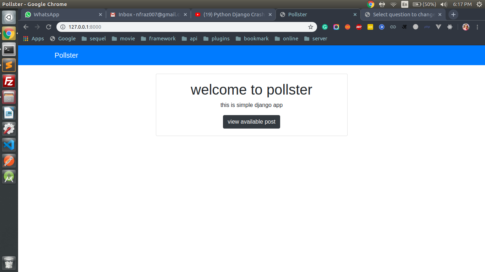
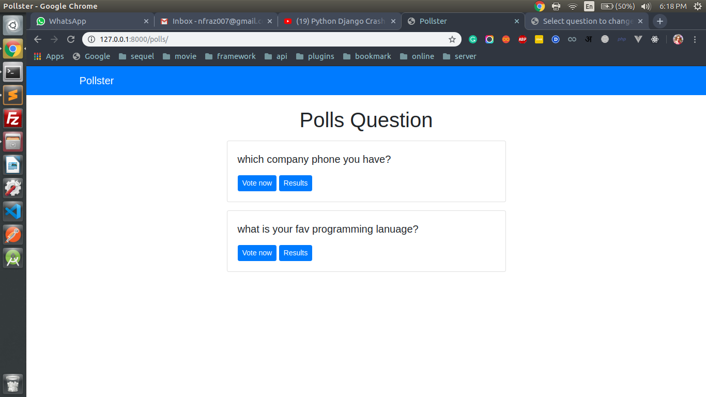
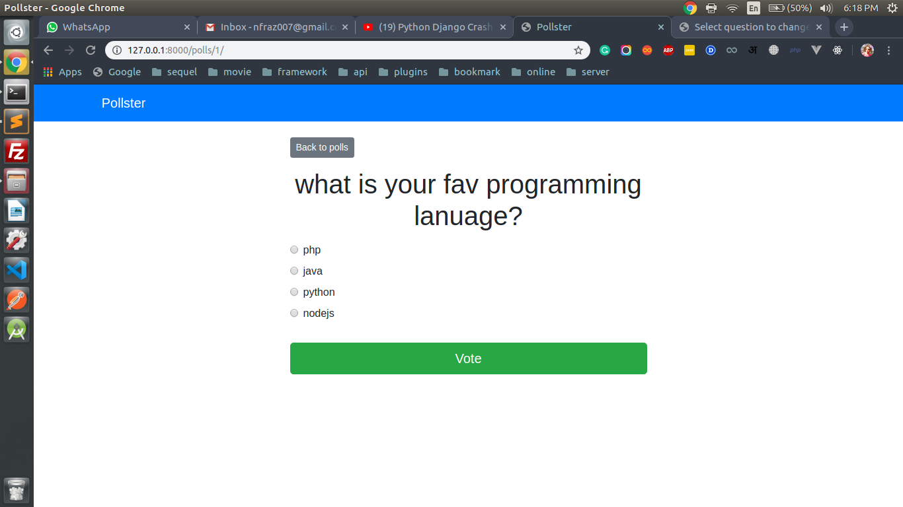
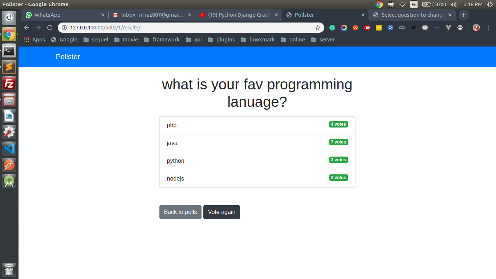

# Pollster 
This is a pollster app for create a poll and give made in python framework Django

## Technology
Django, Sqlite

## Snapshot
* Home page


* All polls listing


* Voting page


* Voting result page


## Important Command

* Install custom env for this project
> pip3 install pipenv


* Create virtual env
> pipenv shell

* Install django
> pipenv install django

Move inside the project directory
* create pollster project
> django-admin startproject pollster

* run a server in custom port
> python3 manage.py runserver 8081

* run migration
> python3 manage.py migrate

* create a app
> python3 manage.py startapp polls

* create migration for polls
> python3 manage.py makemigrations polls

* to open shell , same like tinker in laravel
> python3 manage.py shell 

## Some Sqlite query

* First go to shell like shell command, then import the model like this
> from polls.models import Question,Choice

* Return all the data in an array
> Question.objects.all()

* this is how to insert

```
from django.utils import timezone
q = Question(question_text="text", pub_date=timezone.now())
q.save()
```

* this is like where clause, it will return data in array
> Question.objects.filter(id=1)

* this is like first() in laravel, pk is primary key and it will return a single array
> Question.objects.get(pk=1)